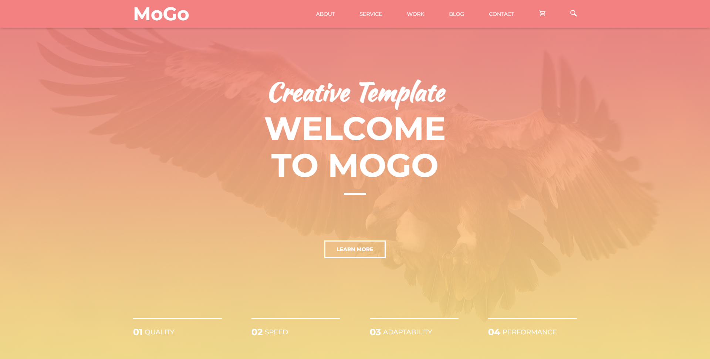

# MoGo

📄 **mogo** - это мой самый первый проект. Простой одностраничный сайт с кроссбраузерной, отзывчивой и адаптивной версткой. Был создан на основе PSD макета с сайта: [psd-html-css.ru](http://psd-html-css.ru/templates/mogo-besplatnyy-psd-shablon-lendingovoy-stranicy). Так же во время верстки я опирался на курс видеоуроков от канала [BrainsCloud](https://www.youtube.com/channel/UCqGjCzCi5zG3RjJUA-ZDBkQ).

---

## about:

📑 Мне захотелось впервые ощутить это чувство "завершенности проекта", поэтому я решил написать самое простое, что есть в вебе - отзывчиво адаптивный лэндинг. И по ходу разработки натыкался на разные возможности у нативных **HTML5** и **CSS3**, затем открыл для себя препроцессоры и стал внедрять новые паттерны верстки.

- 📝 Краткий очерк по проделанной работе:
  - Первая практика в использовании основ верстки **flex** и **grid** контейнеров;
  - Вся анимация и сложные конструкции: point-slider, burger-menu и т.п. были реализованы на нативном **HTML5 & CSS3**;
  - И так же первые шаги в освоении препроцессоров, в частности **SCSS**;
  - И думаю наиболее главное - первый опыт в написании отзывчивой, кросс браузерной и адаптивной верстки;

---

## warning:

> 📌 _Работа над проектом прекращена:_
>
> > **mogo** _- это просто практика в верстке. Проект без использования **JavaScript**._
>
> **P.s.** _спасибо за ознакомление с работой_ 👋

---

<h1 align="center"><a href="https://lapard1n.github.io/mogo">mogo:</a></h1>

---
